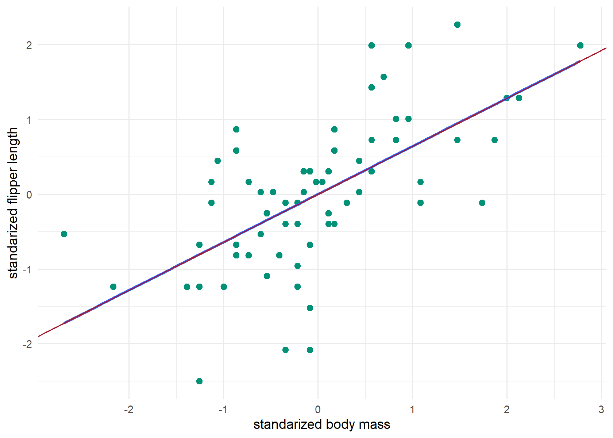
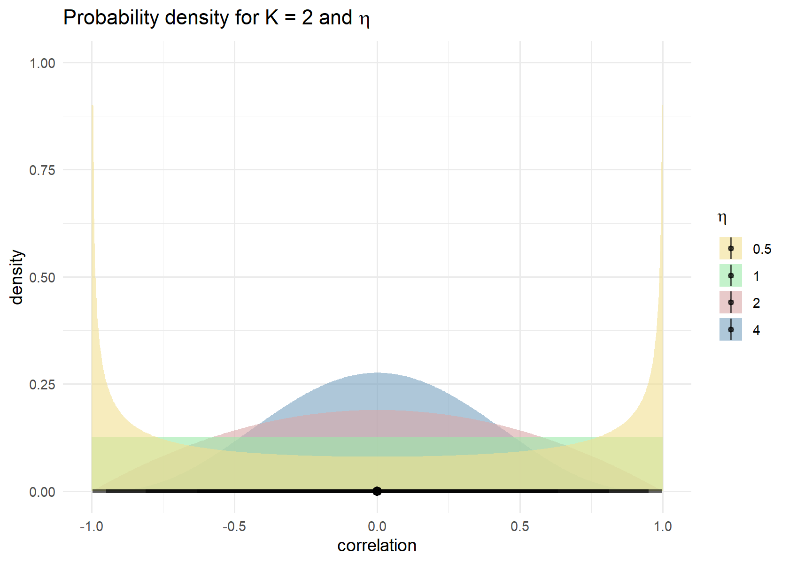

TIL: Correlation and regression
================
3/25/23

``` r
library(patchwork)
library(palmerpenguins)
library(faux)
library(GGally)
library(tidyverse)
library(brms)
library(tidybayes)
set.seed(1234)
```

A while ago I read something in Andrew Gelman’s blog about correlation
and regression. The post is titled [How to think about correlation? It’s
the slope of the regression when x and y have been
standardized](https://statmodeling.stat.columbia.edu/2020/12/03/how-to-think-about-correlation-its-the-slope-of-the-regression-when-x-and-y-have-been-standardized/).
He says “I replied that the way I think about the correlation is that
it’s the slope of the regression of y on x if the two variables have
been standardized to have the same sd. And I pointed him to section 12.3
of Regression and Other Stories, which discusses this point.”

So, here are my notes on that.

## Standarized scores

The place to start for me is standardized scores. I can get standardized
scores by converting them to z-scores. There are other scores that
qualify as standardized scores (I gather that standardized scores are
not synonym with z-scores, even though many people take them as
synonyms). z-scores are nice because they tells us how many standard
deviations above or below the mean (of its distribution) a score is,
regardless of the initial units of measurement.

We get z-scores by subtracting from each value its mean and then
dividing by the standard deviation.

$$
\textit{z} = \frac{\textrm{X} - {\mu}}{\sigma}
$$ where:

${\mu}$ is the mean of the population, ${\sigma}$ is the standard
deviation of the population.

I’m going to use the Palmer penguins dataset as an example (I just
finished attending a workshop that used that dataset). First, let’s see
what flipper length looks like for the Chinstrap penguins.

``` r
penguins |>
  filter(species == "Chinstrap") |>
  ggplot(aes(x = flipper_length_mm)) +
  geom_histogram(binwidth = 1, fill = "#78a2c0") +
  labs(x = "flipper length (mm)") +
  theme_minimal()
```


``` r
penguins |>
  filter(species == "Chinstrap") |>
  summarize(mean_flipper_length_mm = mean(flipper_length_mm),
            sd = sd(flipper_length_mm))
```

    # A tibble: 1 × 2
      mean_flipper_length_mm    sd
                       <dbl> <dbl>
    1                   196.  7.13

So, the mean flipper length is 196mm and the sd 7mm. Now, let’s create
the z-scores.

``` r
chinstrap <- penguins |>
  filter(species == "Chinstrap") 

chinstrap_with_z <- chinstrap |>
  mutate(mean_flipper_length_mm = mean(flipper_length_mm),
         sd_flipper_length_mm = sd(flipper_length_mm),
         z_flipper_length_mm = (flipper_length_mm - mean_flipper_length_mm)/sd_flipper_length_mm)

chinstrap_with_z |>
  select(species, flipper_length_mm, mean_flipper_length_mm, sd_flipper_length_mm, z_flipper_length_mm) |>
  head(10)
```

    # A tibble: 10 × 5
       species   flipper_length_mm mean_flipper_length_mm sd_flipper_length_mm
       <fct>                 <int>                  <dbl>                <dbl>
     1 Chinstrap               192                   196.                 7.13
     2 Chinstrap               196                   196.                 7.13
     3 Chinstrap               193                   196.                 7.13
     4 Chinstrap               188                   196.                 7.13
     5 Chinstrap               197                   196.                 7.13
     6 Chinstrap               198                   196.                 7.13
     7 Chinstrap               178                   196.                 7.13
     8 Chinstrap               197                   196.                 7.13
     9 Chinstrap               195                   196.                 7.13
    10 Chinstrap               198                   196.                 7.13
    # ℹ 1 more variable: z_flipper_length_mm <dbl>

A z score of 2.00 always signifies that the original score is exactly
two standard deviations above its mean. In this case, a flipper length
of 188mm is around one standard deviation from the mean.

And now let’s see how it looks like.

``` r
chinstrap_with_z |>
  ggplot(aes(x = z_flipper_length_mm)) +
  geom_histogram(fill = "#7f8cb0") +
  labs(x = "standarized flipper length") +
  theme_minimal()
```

    `stat_bin()` using `bins = 30`. Pick better value with `binwidth`.


Converting all original observations into z scores leaves the normal
shape intact but not the units of measurement (that’s the value!). If
the original distribution approximates a normal curve, then the shift to
standard or z scores will always produce a new distribution that
approximates the standard normal curve. This is the one normal curve for
which a table is actually available (the one with z-scores in one size
and proportions on the other).

If we take a look at the table (usually in the back of a stats book),
we’ll see that at 1 standard deviation we cover 68% of the curve
(34.1% + 34.1%), at 2 standard deviation we cover 95% (47.7% + 47.7%),
etc. This is known as the [empirical
rule](https://en.wikipedia.org/wiki/68%E2%80%9395%E2%80%9399.7_rule)

## Correlation

Now, let’s look at the correlation between flipper length (mm) and body
mass (grams) in the Chinstrap penguins. First let’s visualize the data

``` r
chinstrap |>
  ggplot(aes(x = body_mass_g, y = flipper_length_mm)) +
  geom_point(color = "#019176", size = 2) +
  labs(x = "body mass (g)",
       y = "flipper length (mm)") +
  theme_minimal()
```


It looks like there is a linear relation with, penguins that are bigger,
having longer flippers. Now, we can calculate the Pearson correlation
coefficient, r, which is defined as

$$
\textit{r} = \frac{SP_{xy}}{\sqrt{SS_xSS_y}}
$$ where

$$
\textit{SS}{_x} = \sum{X^2}- \frac{(\sum{X})^2}{\textit{n}}
$$

$$
\textit{SS}{_y} = \sum{Y^2}- \frac{(\sum{Y})^2}{\textit{n}}
$$

$$ 
SP_{xy} = \sum{XY}-\frac{(\sum{X})(\sum{Y})}{n}
$$ That is a lot of stuff. In the numerator there is the sum of
products, and in the denominator the sum of the products for each pair
of deviation scores.

So, let’s calculate that, one by one.

``` r
chinstrap_r <- chinstrap |>
  select(species, flipper_length_mm, body_mass_g) |>
  mutate(XY = flipper_length_mm * body_mass_g,
         X_squared = flipper_length_mm^2,
         Y_squared = body_mass_g^2)

sum_X <- sum(chinstrap_r$flipper_length_mm) |> as.numeric()

sum_Y <- sum(chinstrap_r$body_mass_g) |> as.numeric()

sum_XY <- sum(chinstrap_r$XY)  |> as.numeric()

sum_Xsquared <- sum(chinstrap_r$X_squared) |> as.numeric()

sum_Ysquared <- sum(chinstrap_r$Y_squared) |> as.numeric()

n = nrow(chinstrap_r) |> as.numeric()

SP = sum_XY - ((sum_X*sum_Y) / n)

SSx = sum_Xsquared - ((sum_X)^2 / n)

SSy = sum_Ysquared - ((sum_Y)^2 / n)

r = SP / sqrt(SSx*SSy)
```

So, we get an r of 0.64. Now, let’s check with the build in function.

``` r
cor(chinstrap_r$flipper_length_mm, chinstrap_r$body_mass_g, method = c("pearson"))
```

    [1] 0.6415594

So, we got the same thing!

Another way to do the above. Gelman et al. (2020) write “If two random
variables *u* and *v* have mean $\mu_u$, $\mu_v$ and standard deviations
$\sigma_u$, $\sigma_v$ , then their correlation is defined as
$\rho_{uv} = \operatorname E ((u - \mu_u)(v - \mu_v)) / (\sigma_u \sigma_v)$”
(p. 43). I need to get back to this formula later.

## Regresion

Now, let’s check what happens in a regression.

In the book Regression and Other Stories, Gelman et al. (2020) write
“Consider a regression with a constant term and one predictor; thus,
$y = a + bx + error$. If both of the variables $x$ and $y$ are
standardized -that is, if they are defined as `x <- (x-mean(x))/sd(x)`
and `y <- (y-mean(y))/sd(y)` -then the regression intercept is zero, and
the slope is simply the correlation between x and y. Thus, the slope of
a regression of two standardized variables must always be between -1 and
1, or, to put it another way, if a regression slope is more than 1 in
absolute value, then the variance of $y$ must exceed that of $x$. In
general, the slope of a regression with one predictor is
$b = \rho \sigma_y / \sigma_x$, where $\rho$ is the correlation between
the two variables and $\sigma_x$ and $\sigma_y$ are the standard
deviations of $x$ and $y$.” (p. 187).

In other words, for this case (or in the case of simple, univariate
standardized regression), the regression formula is $y = 0 + r y$. So,
let’s check that.

First, let’s plot the standardized scores for flipper length and body
mass.

``` r
chinstrap_sd <- penguins |>
  filter(species == "Chinstrap") |>
  mutate(flipper_length_mm_sd = (flipper_length_mm - mean(flipper_length_mm)) / sd(flipper_length_mm), 
         body_mass_g_sd = (body_mass_g - mean(body_mass_g)) / sd(body_mass_g))

chinstrap_sd |>
  ggplot(aes(x = body_mass_g_sd, y = flipper_length_mm_sd)) +
  geom_point(color = "#019176", size = 2) +
  labs(x = "standarized body mass",
       y = "flipper length") +
  theme_minimal()
```


The are both centered at 0. Let’s check their means:

``` r
round(mean(chinstrap_sd$flipper_length_mm_sd),2)
```

    [1] 0

``` r
round(mean(chinstrap_sd$body_mass_g_sd),2)
```

    [1] 0

Now, let’s calculate the regression using lm:

``` r
model1 <- lm(flipper_length_mm_sd ~ body_mass_g_sd,
   data = chinstrap_sd)

summary(model1)
```


    Call:
    lm(formula = flipper_length_mm_sd ~ body_mass_g_sd, data = chinstrap_sd)

    Residuals:
         Min       1Q   Median       3Q      Max 
    -2.02325 -0.46712  0.05745  0.40506  1.62567 

    Coefficients:
                    Estimate Std. Error t value Pr(>|t|)    
    (Intercept)    1.293e-15  9.372e-02   0.000        1    
    body_mass_g_sd 6.416e-01  9.442e-02   6.795 3.75e-09 ***
    ---
    Signif. codes:  0 '***' 0.001 '**' 0.01 '*' 0.05 '.' 0.1 ' ' 1

    Residual standard error: 0.7729 on 66 degrees of freedom
    Multiple R-squared:  0.4116,    Adjusted R-squared:  0.4027 
    F-statistic: 46.17 on 1 and 66 DF,  p-value: 3.748e-09

``` r
round(model1$coefficients,2)
```

       (Intercept) body_mass_g_sd 
              0.00           0.64 

And there it is. Intercept is zero, and the slope is 0.64. Let’s plot
that to visualize it.

``` r
chinstrap_sd |>
  ggplot(aes(x = body_mass_g_sd, y = flipper_length_mm_sd)) +
  geom_point(color = "#019176", size = 2) +
  geom_smooth(method='lm', se = FALSE) +
  geom_abline(slope = r, intercept = 0, color = "#a6192c") +
  labs(x = "standarized body mass",
       y = "standarized flipper length") +
  theme_minimal()
```

    `geom_smooth()` using formula = 'y ~ x'


One line, the blue one, is showing the regression model. The other line,
the red one, is showing the correlation coefficient.

Gelman et al. (2020) also say “in a least square regression with one
predictor, one can show $R^2$ equals the square of the correlation
between *x* and *y*…There is no such interpretation for regressions with
more than one predictor” (p. 169). Let’s see.

``` r
r^2
```

    [1] 0.4115985

Yes, that’s what we get from the lm() output!

## Bayesian regression

Now, there are a couple of things I need to keep in mind about this. And
to make those points, let’s do the same process but with a Bayesian
approach. So, we write the formula:

$$
\begin{align*}
{y_{i}} & \sim \textrm{Normal}({\mu_i,\sigma}) \\
\mu_{i} & =  \alpha + \beta \, \textrm{bodymass}_{i} \\
\alpha & \sim \textrm{Normal}(0,1) \\
\beta & \sim \textrm{Normal}(0,1) \\
\end{align*}
$$

``` r
model1 <- brm(
  data = chinstrap_sd,
  family = gaussian,
  flipper_length_mm_sd ~ 1 + body_mass_g_sd,
  prior = prior(normal(0, 1), class = Intercept) +
    prior(normal(0, 1), class = b)
  )
```

    Compiling Stan program...

    Start sampling

Let’s look at the summary.

``` r
summary(model1)
```

     Family: gaussian 
      Links: mu = identity; sigma = identity 
    Formula: flipper_length_mm_sd ~ 1 + body_mass_g_sd 
       Data: chinstrap_sd (Number of observations: 68) 
      Draws: 4 chains, each with iter = 2000; warmup = 1000; thin = 1;
             total post-warmup draws = 4000

    Population-Level Effects: 
                   Estimate Est.Error l-95% CI u-95% CI Rhat Bulk_ESS Tail_ESS
    Intercept         -0.00      0.09    -0.19     0.18 1.00     4028     2895
    body_mass_g_sd     0.64      0.09     0.45     0.82 1.00     4344     3006

    Family Specific Parameters: 
          Estimate Est.Error l-95% CI u-95% CI Rhat Bulk_ESS Tail_ESS
    sigma     0.79      0.07     0.66     0.94 1.00     3600     2902

    Draws were sampled using sampling(NUTS). For each parameter, Bulk_ESS
    and Tail_ESS are effective sample size measures, and Rhat is the potential
    scale reduction factor on split chains (at convergence, Rhat = 1).

Okay, so it is the same 0.64 value as before. Notice that we not only
get the slope (our beta) but also we get uncertainty around it! Let’s
plot it.

``` r
as_draws_df(model1) |>
  ggplot(aes(x = b_body_mass_g_sd)) +
  stat_halfeye(point_interval = mean_qi, fill = "#e9c46a") +
  scale_x_continuous(expression(beta), limits = c(0,1)) +
  theme_minimal()
```

    Warning: Removed 1 rows containing missing values (`stat_slabinterval()`).



## Bounded at 1?

Correlation coefficients give you a bounded measure. That is, the
coefficient is between -1 and 1. It should be the same case for the
slope. As Gelman et al. (2020) put it “Thus, the slope of a regression
of two standardized variables must always be between -1 and 1, or, to
put it another way, if a regression slope is more than 1 in absolute
value, then the variance of $y$ must exceed that of $x$.” (p. 187). I’ll
return to this point below.

They go on to say “The *principal component line* \[figure on the left\]
minimizes the sum of squared distances between points and line. The
*principal component line* in this case is simply y = x”. \[The figure
on the right\] “shows the *regression line* which minimizes the sum of
the squares of the vertical distances between the points and the line
-it is the familiar least squares line.” Let’s replicate a similar
example to the one in the book:

``` r
n = 1000
rho = .5
x <- rnorm(n = n, mean = 0, sd = 1)
y <- (rho * x) + sqrt(1 - rho*rho) * rnorm(n = n, mean = 0, sd = 1)

plot_principal <- tibble(x, y) |>
  ggplot(aes(x = x, y = y)) +
  geom_abline(color = "#6f7f7e") +
  geom_point(size = 0.5, alpha = 0.4, color = ifelse(x < -2, "red", "black")) +
  scale_x_continuous(breaks = NULL, limits = c(-4, 4)) +
  scale_y_continuous(breaks = NULL, limits = c(-4, 4)) +
  labs(subtitle = "principal component line") +
  coord_equal() +
  theme_minimal()

plot_regression <-tibble(x, y) |>
  ggplot(aes(x = x, y = y)) +
  geom_abline(color = "#6f7f7e", slope = 0.5) +
  geom_point(size = 0.5, alpha = 0.4, color = ifelse(x < -2, "red", "black")) +
  scale_x_continuous(breaks = NULL, limits = c(-4, 4)) +
  scale_y_continuous(NULL, breaks = NULL, limits = c(-4, 4)) +
  labs(subtitle = "regression line of y on x") +
  coord_equal() +
  theme_minimal()

plot_principal + plot_regression
```


Their point is that given the above scatterplot, the regression line
works better for estimating the average of y for any given value of x.
In the red points above, “the principal component line underpredicts *y*
for low values of *x*…and overpredicts y for high values of x”.

Going back to their first point “if a regression slope is more than 1 in
absolute value, then the variance of $y$ must exceed that of $x$.” I’m
trying to figure out what that means since by definition, standardizing
centers the data with a mean of 0 and a standard deviation of 1. So,
let’s simulate data again. I learned about the package below from
Solomon Kurz’s workshop (that workshop was great, by the way).

``` r
d <- rnorm_multi(
    n = 100,
    mu = c(0, 0, 0),
    sd = c(1, 1, 3.7), 
    r = c(.8, .8, .8), 
    varnames = list("x", "y", "z")
) %>% 
  # make standardized versions of the variables
  mutate(x = (x - mean(x)) / sd(x),
         y = (y - mean(y)) / sd(y),
         z = (z - mean(z)) / sd(z))

d %>% 
  select(x:z) %>% 
  ggpairs(upper = list(continuous = wrap("cor", stars = FALSE)),
          lower = list(continuous = wrap("smooth", size = 1/2, alpha = 1/2, se = FALSE)))
```


Let’s double check.

``` r
cor(d$x,d$y)
```

    [1] 0.7575905

okay!

Now, let’s run a similar Bayesian model as the one before with our *x*
and *y*

``` r
model2 <- brm(
  data = d,
  family = gaussian,
  y ~ 1 + x,
  prior = prior(normal(0, 1), class = Intercept) +
    prior(normal(0, 1), class = b)
  )
```

    Compiling Stan program...

    Start sampling

So, here is our summary, with a correlation between x and y of .75 as in
the `ggpairs` plot.

``` r
summary(model2)
```

     Family: gaussian 
      Links: mu = identity; sigma = identity 
    Formula: y ~ 1 + x 
       Data: d (Number of observations: 100) 
      Draws: 4 chains, each with iter = 2000; warmup = 1000; thin = 1;
             total post-warmup draws = 4000

    Population-Level Effects: 
              Estimate Est.Error l-95% CI u-95% CI Rhat Bulk_ESS Tail_ESS
    Intercept     0.00      0.06    -0.13     0.13 1.00     4664     3161
    x             0.75      0.07     0.62     0.88 1.00     3838     2939

    Family Specific Parameters: 
          Estimate Est.Error l-95% CI u-95% CI Rhat Bulk_ESS Tail_ESS
    sigma     0.66      0.05     0.58     0.77 1.00     4108     2886

    Draws were sampled using sampling(NUTS). For each parameter, Bulk_ESS
    and Tail_ESS are effective sample size measures, and Rhat is the potential
    scale reduction factor on split chains (at convergence, Rhat = 1).

Now, let’s plot that regression line.

``` r
new_data <- tibble(x = seq(from = -3.5, to = 3.5, length.out = 50))

fitted(model2, newdata = new_data) |>
  data.frame() |>
  bind_cols(new_data) |>
  ggplot(aes(x = x)) +
  geom_ribbon(aes(ymin = Q2.5 , ymax = Q97.5),
              alpha = 1/3) +
  geom_line(aes(y = Estimate)) +
  geom_point(data = d,
            aes(y = y),
            size = 1/2) +
  coord_equal(xlim = c(-4, 4),
              ylim = c(-4, 4)) +
  theme_minimal() +
  labs(x = "x simulated (standardized)",
       y = "y simulated (standardized)")
```


So, let’s plot that correlation.

``` r
as_draws_df(model2) |>
  ggplot(aes(x = b_x)) +
  stat_halfeye(point_interval = mean_qi, fill = "#e9c46a") +
  scale_x_continuous(expression(rho["y, x"]), limits = c(0,1.2)) +
  theme_minimal()
```


Now, let’s look at the ones with different variance.

``` r
model3 <- brm(
  data = d,
  family = gaussian,
  z ~ 1 + x,
  prior = prior(normal(0, 1), class = Intercept) +
    prior(normal(0, 1), class = b)
  )
```

    Compiling Stan program...

    Start sampling

So, here is our summary.

``` r
summary(model3)
```

     Family: gaussian 
      Links: mu = identity; sigma = identity 
    Formula: z ~ 1 + x 
       Data: d (Number of observations: 100) 
      Draws: 4 chains, each with iter = 2000; warmup = 1000; thin = 1;
             total post-warmup draws = 4000

    Population-Level Effects: 
              Estimate Est.Error l-95% CI u-95% CI Rhat Bulk_ESS Tail_ESS
    Intercept    -0.00      0.06    -0.13     0.12 1.00     3518     2890
    x             0.77      0.06     0.65     0.90 1.00     3166     2543

    Family Specific Parameters: 
          Estimate Est.Error l-95% CI u-95% CI Rhat Bulk_ESS Tail_ESS
    sigma     0.64      0.05     0.56     0.74 1.00     3740     2670

    Draws were sampled using sampling(NUTS). For each parameter, Bulk_ESS
    and Tail_ESS are effective sample size measures, and Rhat is the potential
    scale reduction factor on split chains (at convergence, Rhat = 1).

``` r
as_draws_df(model3) |>
  ggplot(aes(x = b_x)) +
  stat_halfeye(point_interval = mean_qi, fill = "#e9c46a") +
  scale_x_continuous(expression(rho["z, x"]), limits = c(0,1.2)) +
  theme_minimal()
```


In both cases, the slope is almost the same but notice how in the second
model, our estimate for the slope goes beyond 1.

## Bayesian correlation

We did the univariate case above, but in Solomon Kurz’s workshop on
Bayesian regression (2023), he went over Bayesian correlations, so I’m
going to make sure I understood what he said.

He starts “a $\beta_1$ coefficient in a completely standardized
univariable model is in a correlation metric”. Indeed, that’s the
previous sections.

### Fit an unconditional multivariate model

Multivariate models are models with 2 or more dependent (i.e. criterion)
variables. He suggests Bürkner vignette for that: [Estimating
multivariate models with
brms](https://cran.r-project.org/web/packages/brms/vignettes/brms_multivariate.html).

Based on Kurz notes this requires in brms:

- List the criterion variables in the `mvbind()` function on the left
  side of the model formula.
- Wrap the model formula within the `bf()` function.
- Tack `set_rescor(TRUE)` on after the `bf()` statement.
- Indicate which priors go with which criterion variable with the resp
  argument within the `prior()` functions.

In this case we create a multivariate model with an intercept only. It
should return, the correlation we saw in model 3.

``` r
model4 <- brm(
  data = d,
  family = gaussian,
  bf(mvbind(x, z) ~ 1) + set_rescor(TRUE),
  # we continue to use weakly-regularizing priors,
  # this time adjusted to the scale of the standardized data
  prior = prior(normal(0, 1), class = Intercept, resp = x) +
    prior(normal(0, 1), class = Intercept, resp = z) +
    prior(exponential(0.1), class = sigma, resp = x) +
    prior(exponential(0.1), class = sigma, resp = z) +
    # this line is very new
    prior(lkj(2), class = rescor), 
  chains = 4, 
  cores = 4,
  seed = 28)
```

    Compiling Stan program...

    Start sampling

``` r
print(model4, digits = 3)
```

     Family: MV(gaussian, gaussian) 
      Links: mu = identity; sigma = identity
             mu = identity; sigma = identity 
    Formula: x ~ 1 
             z ~ 1 
       Data: d (Number of observations: 100) 
      Draws: 4 chains, each with iter = 2000; warmup = 1000; thin = 1;
             total post-warmup draws = 4000

    Population-Level Effects: 
                Estimate Est.Error l-95% CI u-95% CI  Rhat Bulk_ESS Tail_ESS
    x_Intercept   -0.001     0.098   -0.184    0.194 1.001     2325     2712
    z_Intercept   -0.002     0.099   -0.191    0.194 1.001     2423     2704

    Family Specific Parameters: 
            Estimate Est.Error l-95% CI u-95% CI  Rhat Bulk_ESS Tail_ESS
    sigma_x    1.006     0.071    0.879    1.154 1.001     2567     2661
    sigma_z    1.006     0.072    0.882    1.157 1.000     2648     2812

    Residual Correlations: 
                Estimate Est.Error l-95% CI u-95% CI  Rhat Bulk_ESS Tail_ESS
    rescor(x,z)    0.760     0.043    0.668    0.836 1.001     2503     2646

    Draws were sampled using sampling(NUTS). For each parameter, Bulk_ESS
    and Tail_ESS are effective sample size measures, and Rhat is the potential
    scale reduction factor on split chains (at convergence, Rhat = 1).

The correlation parameter is found in the *Residual Correlations*
section of the output. Kurz says “Keep in mind that a”residual”
correlation in a model with no predictors is the same as a
correlation…Note that with this approach, it’s fine to use wither
standardized or unstandardized versions of the variables in the model.
Either way, the correlation will come out in the same metric.”. Let’s
plot to know how to extract it.

``` r
as_draws_df(model4) |>
  ggplot(aes(x = `rescor__x__z`)) +
  stat_halfeye(point_interval = mean_qi, fill = "#e9c46a") +
  scale_x_continuous(expression(rho["[z, x]"]), limits = c(0, 1)) +
  scale_y_discrete(NULL, expand = expansion(mult = 0.1)) +
  theme(panel.grid.major.y = element_blank(),
        panel.grid.minor = element_blank()) +
  theme_minimal()
```


This can be further extended to a include the other variable.

``` r
model5 <- brm(
  data = d,
  family = gaussian,
  bf(mvbind(x, y, z) ~ 1) + set_rescor(TRUE),
  prior = prior(normal(0, 1), class = Intercept, resp = x) +
    prior(normal(0, 1), class = Intercept, resp = y) +
    prior(normal(0, 1), class = Intercept, resp = z) +
    prior(exponential(0.1), class = sigma, resp = x) +
    prior(exponential(0.1), class = sigma, resp = y) +
    prior(exponential(0.1), class = sigma, resp = z) +
    prior(lkj(2), class = rescor),
  chains = 4, 
  cores = 4,
  seed = 29)
```

    Compiling Stan program...

    Start sampling

``` r
summary(model5)
```

     Family: MV(gaussian, gaussian, gaussian) 
      Links: mu = identity; sigma = identity
             mu = identity; sigma = identity
             mu = identity; sigma = identity 
    Formula: x ~ 1 
             y ~ 1 
             z ~ 1 
       Data: d (Number of observations: 100) 
      Draws: 4 chains, each with iter = 2000; warmup = 1000; thin = 1;
             total post-warmup draws = 4000

    Population-Level Effects: 
                Estimate Est.Error l-95% CI u-95% CI Rhat Bulk_ESS Tail_ESS
    x_Intercept     0.00      0.10    -0.18     0.20 1.00     1998     2426
    y_Intercept     0.00      0.10    -0.18     0.20 1.00     2069     2373
    z_Intercept     0.00      0.09    -0.18     0.19 1.00     2093     2430

    Family Specific Parameters: 
            Estimate Est.Error l-95% CI u-95% CI Rhat Bulk_ESS Tail_ESS
    sigma_x     0.99      0.07     0.87     1.14 1.00     1946     2220
    sigma_y     0.99      0.07     0.87     1.14 1.00     2268     2514
    sigma_z     0.99      0.07     0.87     1.14 1.00     2023     2403

    Residual Correlations: 
                Estimate Est.Error l-95% CI u-95% CI Rhat Bulk_ESS Tail_ESS
    rescor(x,y)     0.73      0.05     0.63     0.81 1.00     2106     2521
    rescor(x,z)     0.75      0.04     0.66     0.83 1.00     2049     2210
    rescor(y,z)     0.73      0.05     0.62     0.81 1.00     2631     3179

    Draws were sampled using sampling(NUTS). For each parameter, Bulk_ESS
    and Tail_ESS are effective sample size measures, and Rhat is the potential
    scale reduction factor on split chains (at convergence, Rhat = 1).

``` r
as_draws_df(model5) |>
  pivot_longer(cols = c(`rescor__x__z`, `rescor__x__y`, `rescor__y__z`)) |>
  ggplot(aes(x = value, y = name)) +
  stat_halfeye(point_interval = mean_qi, fill = "#e9c46a") +
  scale_x_continuous(expression(rho), limits = c(0, 1)) +
  scale_y_discrete(NULL, expand = expansion(mult = 0.1)) +
  theme(panel.grid.major.y = element_blank(),
        panel.grid.minor = element_blank()) +
  theme_minimal()
```

    Warning: Dropping 'draws_df' class as required metadata was removed.


Interesting, the correlation between r and z respects the boundaries. He
says “The multivariate method does not suffer from this problem.
Correlations fit this way should always respect the -1 and 1
boundaries.”

### LKJ Prior

In the previous example, we were introduced to the LKJ prior which
appears to be a favorite one (among people that know) for priors on the
correlations. Solomon (2023) writes “The LKJ is a distribution over
correlation matrices with a single parameter $\eta$. The $\eta$
parameter can take on positive real values, which have an inflection
point at 1. As values increase from 1, more prior mass is placed on
identity matrices (i.e., matrices with 0 correlations). Thus, LKJ priors
with $\eta$ set to values like 2 or 4 are generally considered weakly
regularizing. However, it turns out the LKJ is also sensitive the the
number of variables K in the correlation matrix. As K increases, the LKJ
will regularize more strongly toward the identity matrix (i.e., lower
correlations). To give you a sense of what that looks like, we might
make a plot.”

I like the summary provided on this website: [LKJ correlation
distribution in
Stan](https://yingqijing.medium.com/lkj-correlation-distribution-in-stan-29927b69e9be)

- “if $\eta$ = 1, then the density is uniform over correlation matrices
  of a given order K (the number of row/column). This suggest we do not
  know whether there is a correlation or not. The correlation values can
  be anything between 0 and 1.

- if $\eta$ \> 1, the correlation values in correlation matrices are
  going to centered around 0. higher eta indicate no correlations
  (converge to identity correlation matrix).

- if 0 \< $\eta$ \< 1, the density will centered at two ends. This means
  correlations are favored, but both positive and negative correlation
  values are equally possible.”

Below the “lkjcorr_marginal” comes from Matthew Kay’s package. See the
vignette, [Marginal distribution of a single correlation from an LKJ
distribution](https://mjskay.github.io/ggdist/reference/lkjcorr_marginal.html)

``` r
crossing(eta = c(0.5, 1, 2, 3, 4, 5, 6),
         K   = 2:5) |>
  mutate(strip = str_c("K==", K)) |>
  ggplot(aes(y = eta, dist = "lkjcorr_marginal", arg1 = K, arg2 = eta)) +
  stat_halfeye(.width = .95, fill = "#9be9a8") +
  scale_x_continuous(expression(rho), limits = c(-1, 1),
                     breaks = c(-1, -.5, 0, .5, 1), labels = c("-1", "-.5", "0", ".5", "1")) +
  scale_y_continuous(expression(eta), breaks = c(0.5, 1, 2, 3, 4, 5, 6)) +
  labs(title = expression("Marginal correlation for the LKJ prior relative to K and "*eta),
       y = expression(eta)) +
  facet_wrap(~ strip, labeller = label_parsed, ncol = 4) +
  theme(panel.grid.major.y = element_blank(),
        panel.grid.minor = element_blank()) +
  theme_minimal()
```


I like the way Richard McElreath visualizes this distribution in
Statistical Rethinking, p. 443. He does something like this but better.

``` r
crossing(eta = c(0.5, 1, 2, 4),
         K   = rep(2, 4)) |>
  mutate(strip = str_c("eta==", eta),
         eta_fill = as.character(eta)) |>
  ggplot(aes(dist = "lkjcorr_marginal", arg1 = K, arg2 = eta, fill = eta_fill)) +
  stat_halfeye(.width = .95, alpha = 0.6) +
  coord_flip() +
  scale_fill_manual(values = c("#f2df91", "#9be9a8", "#d9a7a7", "#78a2c0")) +
  labs(title = expression("Probability density for K = 2 and "*eta),
       fill = expression(eta),
       x = "density",
       y = "correlation") +
  theme(panel.grid.major.y = element_blank(),
        panel.grid.minor = element_blank()) +
  theme_minimal()
```



Solomon in his workshop materials continues “Thus, if you want a
non-regularizing prior on $\rho$, fit a bivariate model and set
$\eta$=1. If you want to estimate multiple correlations and you do not
want your correlations regularized toward zero, fit a series of
bivariate models. Otherwise, you’ll need to get comfortable with
shrinkage towards zero.

One more alternative is to use a different prior from the LKJ. For
example, some in the Stan community have suggested truncated normal
priors could work in contexts where you would like to use strong prior
information. For more on the LKJ and this alternative, check out Stephen
Martin’s great (2020) blog post, [Is the LKJ(1) prior uniform?
“Yes”](http://srmart.in/is-the-lkj1-prior-uniform-yes/#:~:text=In%20other%20words%3A%20The%20LKJ,only%20possible%20prior%20for%20correlations.)”

## Links and references

In addition to the links mentioned above. See:

- Gelman, A., Hill, J., & Vehtari, A. (2020). Regression and Other
  Stories.

- Kuper, L. (2018). [Understanding the regression line with standard
  units](https://decomposition.al/blog/2018/08/31/understanding-the-regression-line-with-standard-units/)

- Kurz, S. (2023). [Introduction to Bayesian statistics with brms and
  the tidyverse (03-2023)](https://osf.io/bfvs4/?view_only=).
  Specifically, 14-Bayesian-correlations

In the Stan forums:

[LKJ prior
distribution](https://discourse.mc-stan.org/t/lkj-prior-distribution/6613)

[Underestimating correlation coefficients with LKJ
prior](https://discourse.mc-stan.org/t/underestimating-correlation-coefficients-with-lkj-prior/1758/14)
