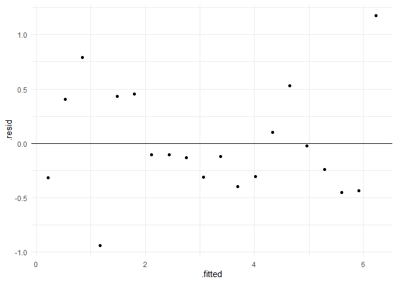

TIL: Linear regression
================
3/25/23

``` r
library(patchwork)
library(palmerpenguins)
library(faux)
library(GGally)
library(tidyverse)
library(brms)
library(tidybayes)
set.seed(1234)
```

I recently took a workshop on Bayesian regression. But I realized during
the courses that I was missing pieces even of the frequentist approach.
Below I try to make sure to capture those pieces.

We start with some data, following an example from Gelman et al. (2020).

``` r
fake <- tibble(x = seq.int(1, 20, by = 1),
               y = 0.2 + 0.3 * x + 0.5 * rnorm(20))

fake |>
  ggplot(aes(x = x, y = y)) +
  geom_point() + 
  theme_minimal()
```


The model is:

$$
\begin{align}
\textit{y}_i & = {\alpha} + {\beta}{x}_i + \epsilon_i\\
\epsilon_i & \sim \operatorname{Normal}(0, \sigma_) 
\end{align}
$$ where the predictor $\text{x}_i$ takes on the values from 1 to 20;
the intercept is $\alpha$ = 0.2, the slope is $\beta$ = 0.3, and the
errors $\epsilon_i$ are normally distributed with mean 0 and standard
deviation $\sigma$ = 0.5.

Now, let’s fit the model.

``` r
simple <- lm(
  y ~ 1 + x, 
  data = fake
)
  
summary(simple)
```


    Call:
    lm(formula = y ~ 1 + x, data = fake)

    Residuals:
        Min      1Q  Median      3Q     Max 
    -0.9391 -0.3134 -0.1139  0.4123  1.1747 

    Coefficients:
                Estimate Std. Error t value Pr(>|t|)    
    (Intercept) -0.10055    0.23729  -0.424    0.677    
    x            0.31669    0.01981  15.987 4.42e-12 ***
    ---
    Signif. codes:  0 '***' 0.001 '**' 0.01 '*' 0.05 '.' 0.1 ' ' 1

    Residual standard error: 0.5108 on 18 degrees of freedom
    Multiple R-squared:  0.9342,    Adjusted R-squared:  0.9306 
    F-statistic: 255.6 on 1 and 18 DF,  p-value: 4.417e-12

There is a nice interactive explanation of linear regression here; I
guess within the context of machine learning: [Linear
Regression](https://mlu-explain.github.io/linear-regression/)

The output shows:

- The formula
- Residuals: the difference between the actual observed *y* and the *y*
  the model predicted, $\hat{y}$. The summary points helps us identify
  if the distribution is symmetrical. Basically:

``` r
summary(fake$y - simple$fitted.values)
```

       Min. 1st Qu.  Median    Mean 3rd Qu.    Max. 
    -0.9390 -0.3134 -0.1139  0.0000  0.4123  1.1747 

Using the command:

``` r
residuals(simple)
```

              1           2           3           4           5           6 
    -0.31967208  0.40588818  0.79270691 -0.93904977  0.43167419  0.45345255 
              7           8           9          10          11          12 
    -0.10363262 -0.10626580 -0.13186311 -0.31134327 -0.12160794 -0.39889205 
             13          14          15          16          17          18 
    -0.30451301  0.09915610  0.52998649 -0.02159053 -0.23863977 -0.45541997 
             19          20 
    -0.43509534  1.17472085 

We can plot the residuals. In general, we want those residuals to look
gaussian:

``` r
tibble(r = residuals(simple)) |>
  ggplot(aes(x = r)) +
  geom_histogram(binwidth = 0.5)
```


And sometimes people do a Q–Q plot. Or we can just plot the residuals.

``` r
ggplot(simple, aes(x = .fitted, y = .resid)) +
  geom_point() +
  geom_hline(yintercept = 0) +
  theme_minimal()
```



or

``` r
ggplot(simple, aes(x = .resid)) +
  geom_histogram(binwidth = 0.5) +
  scale_x_continuous(limits = c(-1.5, 1.5)) +
  theme_minimal()
```

    Warning: Removed 2 rows containing missing values (`geom_bar()`).


Gelman et al. (2020) in the section about assumptions of regression
analysis mention the following assumptions in order of importance:

- validity,
- representativeness,
- additivity and linearity,
- independence of errors,
- equal variance of errors, and
- normality of errors.

Notice *equal variance of errors* and *normality of error* but only
toward the end of the list!

- The coefficients

``` r
coef(simple)
```

    (Intercept)           x 
     -0.1005480   0.3166872 

- The standard error of the estimates.

- The t-statistic from which our p-values came from; the t-statistic is
  the coefficient divided by the standard error.

- Residual standard error, the square root of a sum of squares term
  divided by its degrees of freedom (20 data points minus two
  parameters, intercept and slope). This is the average amount that *y*
  will deviate from the regression line. We can get that residual
  standard error this way:

``` r
k = length(simple$coefficients)-1

SSE = sum(simple$residuals**2)

n = length(simple$residuals)

sqrt(SSE/(n-(1+k))) 
```

    [1] 0.5108217

or like this:

``` r
tibble(r = residuals(simple)) |>
  summarise(m = mean(r),
            s = sd(r))
```

    # A tibble: 1 × 2
             m     s
         <dbl> <dbl>
    1 7.99e-18 0.497

Now plot:

``` r
fake |>
  ggplot(aes(x = x, y = y )) +
  geom_point() +
  geom_abline(intercept = simple$coefficients[1], slope = simple$coefficients[2], color = "#90be6d") +
  labs(title = "Data and fitted regression line") +
  theme_minimal()
```


We can use predict to give us the model-based predictions of each case
in the data. We get one prediction, one fitted value, for each case in
the data set.

``` r
predict(simple)
```

            1         2         3         4         5         6         7         8 
    0.2161392 0.5328264 0.8495137 1.1662009 1.4828882 1.7995754 2.1162626 2.4329499 
            9        10        11        12        13        14        15        16 
    2.7496371 3.0663244 3.3830116 3.6996988 4.0163861 4.3330733 4.6497605 4.9664478 
           17        18        19        20 
    5.2831350 5.5998223 5.9165095 6.2331967 

We might want to express the uncertainty around those predictions with
confidence intervals.

``` r
predict(simple,
        interval = "confidence") |>
  # just the top 6
  head()
```

            fit        lwr       upr
    1 0.2161392 -0.2463504 0.6786288
    2 0.5328264  0.1053672 0.9602857
    3 0.8495137  0.4558005 1.2432269
    4 1.1662009  0.8045896 1.5278122
    5 1.4828882  1.1512570 1.8145193
    6 1.7995754  1.4951749 2.1039759

Predict has the interval argument. point estimate, and upper and lower
level 95% confidence intervals. We can also ask for the standard errors
of each person predictions or the standard error of predicted means:

``` r
predict(simple,
        se.fit = TRUE) |> 
  data.frame()
```

             fit    se.fit df residual.scale
    1  0.2161392 0.2201365 18      0.5108217
    2  0.5328264 0.2034627 18      0.5108217
    3  0.8495137 0.1874002 18      0.5108217
    4  1.1662009 0.1721203 18      0.5108217
    5  1.4828882 0.1578503 18      0.5108217
    6  1.7995754 0.1448890 18      0.5108217
    7  2.1162626 0.1336178 18      0.5108217
    8  2.4329499 0.1244965 18      0.5108217
    9  2.7496371 0.1180247 18      0.5108217
    10 3.0663244 0.1146518 18      0.5108217
    11 3.3830116 0.1146518 18      0.5108217
    12 3.6996988 0.1180247 18      0.5108217
    13 4.0163861 0.1244965 18      0.5108217
    14 4.3330733 0.1336178 18      0.5108217
    15 4.6497605 0.1448890 18      0.5108217
    16 4.9664478 0.1578503 18      0.5108217
    17 5.2831350 0.1721203 18      0.5108217
    18 5.5998223 0.1874002 18      0.5108217
    19 5.9165095 0.2034627 18      0.5108217
    20 6.2331967 0.2201365 18      0.5108217

Or we can use a new data set; that is, define a prediction grid for
which we want predictions. The function will then give us predictions
based on these new values.

``` r
new_data <- tibble(x = seq.int(0.5, 20.5, by = 1))

predict(simple,
        interval = "confidence",
        newdata = new_data) |>
  head()
```

             fit         lwr       upr
    1 0.05779559 -0.42260341 0.5381946
    2 0.37448282 -0.07034976 0.8193154
    3 0.69117006  0.28076445 1.1015757
    4 1.00785730  0.63042728 1.3852873
    5 1.32454454  0.97822390 1.6708652
    6 1.64123178  1.32360548 1.9588581

Given the original predictor grid, with the bind functions we can bind
new columns. Now we can add our predictor values, *x*, along with our
predicted values, *y*. In red below, we can see the data in the model,
*x* and *y*, and in green, the new data for the predictions.

``` r
predict(simple,
        interval = "confidence",
        newdata = new_data) |>
  data.frame() |>
  bind_cols(new_data) |>
  ggplot(aes(x = x)) +
  geom_ribbon(aes(ymin = lwr, ymax = upr),
              alpha = 1/3) +
  geom_line(aes(y = fit)) +
  geom_point(aes(x = x, y = fit), color = "#2bc2c2", alpha = 0.6) +
  geom_point(data = fake,
             aes(x = x, y = y), color= "#ff483b", alpha = 0.6)
```


